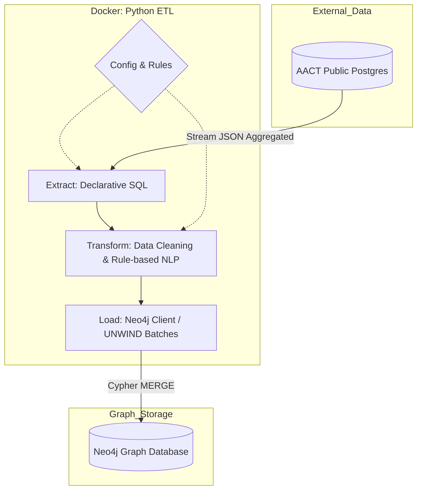

# ClinicalTrials.gov → Neo4j (AACT ETL)

## About the Project
This repository implements a complete, idempotent, and containerized ETL pipeline that extracts clinical data from AACT (ClinicalTrials.gov public PostgreSQL), transforms and enriches the information, and loads everything into a Neo4j graph. The goal is to provide a useful model for exploring:

- Clinical trials (Trial)
- Drugs/Interventions (Drug)
- Conditions/Diseases (Condition)
- Sponsors/Organizations (Organization)
- Route of administration and dosage form (as properties on the Trial–Drug relationship)

## Architecture (Separation of Responsibilities)
The pipeline architecture was designed to reflect separation of responsibilities, configurability, and idempotency, aligned with what the challenge values ("well-architected pipeline", "config-driven", "batching/backpressure", "idempotent loads"). This organization follows the "clear structure" guideline: each module has a single mission (read, process, load, orchestrate), and rules/queries are kept in config to facilitate adjustments without touching the code.

### System Features
- **Batch & Idempotent:** MERGE on all entities. Re-running the ETL does not duplicate data.
- **Config-driven:** SQL, entity extraction rules, and sensitive variables in dedicated files.
- **Lightweight & Reproducible:** Rule-based NLP instead of heavy LLM/NER. Lean Docker image.
- **Resilient:** Constraints and indexes applied automatically. Clear progress logs.

## Diagram (Overview)


### Main Modules

```
.
├── config
│   ├── extract_trials.sql
│   └── text_rules.yaml
├── src
│   ├── extract
│   │   ├── __init__.py 
│   │   └── aact_client.py
│   ├── transform
│   │   ├── __init__.py
│   │   ├── data_cleaner.py
│   │   └── text_parser.py
│   ├── load
│   │   ├── __init__.py
│   │   └── neo4j_client.py
│   └── main.py
├── tests
│   ├── test_data_cleaner.py
│   ├── test_text_parser.py
│   ├── test_readme_example.py
│   ├── test_bonus_integration.py
├── scripts
|   ├── analyzes_entity_extraction_metrics.py
├── docs
│   ├── topDrugs.png
│   ├── byCompany_Novartis.png
│   ├── byCondition_Alzheimers.png
│   ├── route_dosage_form_coverage.png
├── .env
├── README.md
├── docker-compose.yml
├── Dockerfile
├── queries.cypher
└── requirements.txt
```

- `config/extract_trials.sql` — Declarative extraction query (AACT → JSON aggregated by study).
- `config/text_rules.yaml` — Declarative inference rules (route/dosage_form) based on keywords.
- `src/extract/aact_client.py` — AACT read adapter (PostgreSQL), streaming in batches.
- `src/transform/data_cleaner.py` — Field normalization and cleaning orchestration (includes route/dosage_form in STUDIED_IN).
- `src/transform/text_parser.py` — Rule-based inference of route/dosage_form from free text.
- `src/load/neo4j_client.py` — Neo4j write adapter (constraints, indexes, batch loading via UNWIND).
- `src/main.py` — Pipeline orchestrator (Extract → Transform → Load) with configurable batch and limit.
- `scripts/analyzes_entity_extraction_metrics.py` — Analysis script that extracts data from AACT, analyzes drug description coverage, calculates route/dosage_form inference metrics, and validates results by comparing with Neo4j.
- `docs`— Contains screenshots of query results, as requested in the code challenge.
- `queries.cypher` — Demonstration queries for quick validation in Neo4j.


## Unit Tests and Integration Test (bonus)
- `tests/test_text_parser.py` — Unit test that validates route/dosage_form parser.
- `tests/test_data_cleaner.py` — Unit test that validates cleaner/data normalization.
- `tests/test_readme_example.py` — Unit test that validates an example described in this README (End to End of a single record.)
- `tests/test_bonus_integration.py` — Integration test (bonus) that extracts, transforms, and loads a small dataset into Neo4j
- Test logs show loaded batches, progress, and loading, useful for monitoring execution.


## How the System Works (meeting functional requirements)

1) **Ingestion (reproducible query, non-trivial dataset, clinical stage)**  
   - Versioned query in `config/extract_trials.sql`: interventional studies in PHASE1/2/3/4 (includes PHASE1/PHASE2, PHASE2/PHASE3) and `intervention_type IN ('DRUG','BIOLOGICAL')` (my definition of "clinical-stage based on documentation").  
   - Returns aggregated by study (`json_agg`) and, by default, processes 1000 trials (≥ 500 required). No binaries/dumps: always current data from public AACT.

2) **Transformation (minimum fields, normalization, missing/duplicates)**  
   - Captures: Drug (list of interventions), Condition, Organization (sponsor/collaborators), NCT ID, Title, Phase, Status; route/dosage_form if text is available.  
   - Normalizes texts (trim/Title Case) and deduplicates conditions; missing fields become `Unknown` in route/dosage_form instead of generating errors; keeps placebo for fidelity.

3) **Modeling and Loading (graph, contextual route/dosage_form, idempotency) - Neo4J**  
   - Nodes: Trial, Drug, Condition, Organization.  
   - Relationships: `STUDIED_IN` (properties `route`, `dosage_form`), `SPONSORED_BY`, `STUDIES_CONDITION`. route/dosage_form are on the relationship (trial-specific), as per the requirements.  
   - Schema guaranteed on start: uniqueness constraints on nct_id and names; indexes on phase/status. Batch loading with `UNWIND + MERGE` (idempotent, no manual steps).

4) **Validation (required queries)**  
   - `queries.cypher` contains four validation queries: (1) top drugs by number of trials; (2) by company, listing drugs and conditions; (3) by condition, showing drugs and phases; (4) route/dosage_form coverage.


## Deep Dive: The Entity Extraction Challenge

Inferring route and dosage form from free text in ClinicalTrials.gov is difficult due to lack of standardization. The chosen strategy is a deliberate baseline, prioritizing precision and transparency over recall. The possible "evolution ladder":

- **Level 1 (current) — Heuristics / Keywords (rules):** Low cost, deterministic behavior, and easy auditing; executes in a few seconds in Docker environment. Coverage is limited, as many descriptions contain only the drug name. In this scenario, we choose to return `Unknown` instead of assuming information and generating false positives.
- **Level 2 — Structured regex:** discarded here because descriptions do not follow a fixed pattern (dose/drug order varies, text is sparse).
- **Level 3 — Biomedical NLP (SciSpacy/BioBERT):** higher recall without depending on exact words; higher image/build cost and more dependencies.
- **Level 4 — LLMs/AI Functions (GPT-4, Llama-3 via Databricks or local):** better potential accuracy, but brings cost, latency, and requires human validation (human-in-the-loop) and governance.

Positioning: we maintained Level 1 to fulfill the challenge with lightness, reproducibility, and clarity. Natural next steps would be to experiment with Level 3 (biomedical models) or Level 4 (LLM) if we accept higher cost/complexity in exchange for higher recall.


## Inference of route/dosage_form from the description field
File: `config/text_rules.yaml`
- Keyword rules for `routes` (Oral, Intravenous, Subcutaneous, etc.) and `dosage_forms` (Tablet, Injection, Cream, etc.).
- Applied to the intervention's **description**. If there is no text, returns `Unknown`.

**Detailed Analysis of Entity Extraction Method Accuracy for 1000 trials:**
- Total Trial–Drug relationships: 1,645
- Trial–Drug relationships without drug description: 1,509 (91.7% of total)
- Trial–Drug relationships with drug description: 136 (8.3% of total)
- Of the 136 Trial–Drug relationships with drug description:
  - Route inferred: 40 (29.4% of those with description)
  - Dosage_form inferred: 22 (16.2% of those with description)
  - Both inferred: 16 (11.8% of those with description)

This data can be verified by running the analysis script: `analyzes_entity_extraction_metrics.py`


## Decisions and Rationale

1) **Direct AACT source (public Postgres) vs. local dump (2GB)**
   - Options considered:
     - Download the dump (2GB), set up a local Postgres and load via `pg_restore`.
     - Set up a Postgres container that downloads and restores the dump on build.
     - Connect directly to AACT public Postgres (Playground).
   - We rejected dump/local because: increases build time, requires versioning/downloading large binary, and freezes data (loses updates).
   - We chose public Postgres: it is the "official source", zero versioned binaries, always current data, and "clone & run" experience via Docker Compose (only credentials in `.env`).

2) **Relational query → aggregated JSON (AACT)**
   - Alternatives: join in Python (more I/O, more logic) or aggregate in the database.
   - Choice: use `json_agg` in Postgres to return 1 row per study with lists of drugs/conditions/sponsors, reducing transfer and avoiding manual regrouping. Keeps transformation declarative and versioned in SQL.

3) **Route/dosage_form inference via keywords (rules)**
   - Alternatives: LLM/NER (higher recall, higher cost/weight) or simple heuristics. Includes managed options like Databricks AI Query, which facilitate but depend on cloud, cost, and latency.
   - Choice: rules in `config/text_rules.yaml`, because they are lightweight, auditable, and reproducible in a lean Docker environment. They adhere to the spirit of the challenge (not building a "perfect" pharmaceutical ontology, but a reasonable and documented approach).

4) **Intervention types: DRUG and BIOLOGICAL**
   - Alternatives: only DRUG (loses vaccines/antibodies) or include both.
   - Choice: include DRUG and BIOLOGICAL to cover small molecules, vaccines, and biologics, better meeting the "clinical-stage drugs" criterion.
   - Documented to justify the definition and avoid gaps in results.

5) **Placebo kept**
   - Alternatives: filter placebo in extraction or loading.
   - Choice: keep for fidelity to source and to not embed business rule, facilitates auditing. If you want to filter, it's a simple SQL adjustment.

6) **Sponsors: LEAD only (not collaborators)**
   - Alternatives: capture all sponsors (lead + collaborators) or only lead.
   - Choice: capture only sponsors with `lead_or_collaborator = 'lead'` to focus on the study's main sponsor. This simplifies the graph model (only `SPONSORED_BY` relationship, without need for `COLLABORATES_WITH`) and reduces noise from secondary organizations. The challenge allows "and/or" for these relationships, so `SPONSORED_BY` alone meets the minimum requirement. The `class` property on the `SPONSORED_BY` relationship comes directly from the `agency_class` field of the `sponsors` table in AACT, preserving the original source classification.

7) **Name normalization with `.title()`**
   - Alternatives: advanced normalization pipelines (synonyms, stemming) or keep raw.
   - Choice: `.title()` to reduce trivial variation with low cost. Risk: acronyms may be altered (dnaJ → Dnaj); limitation recorded. Future: list of exceptions/synonyms if needed.


## Extraction Query (AACT)
File: `config/extract_trials.sql`
- Filters **intervention_type IN ('DRUG', 'BIOLOGICAL')** (to cover small molecules and biologics).
- Clinical phases: `PHASE1`, `PHASE2`, `PHASE3`, `PHASE4`, `PHASE1/PHASE2`, `PHASE2/PHASE3`.
- Interventional study: `study_type = 'INTERVENTIONAL'`.
- Groups:
  - `drugs`: list of `{name, description}`
  - `conditions`: list of names
  - `sponsors`: list of `{name, class}`


## README Example: This example is written as the unit test `tests/test_readme_example.py`

Extract:
```
{
  "nct_id": "NCT00000102",
  "brief_title": "Study of Drug X in Condition Y",
  "phase": "PHASE3",
  "overall_status": "COMPLETED",
  "drugs": [
    {"name": "Drug X", "description": "Oral tablet administered daily"}
  ],
  "conditions": ["Condition Y"],
  "sponsors": [
    {"name": "Example Pharma Inc", "class": "INDUSTRY"}
  ]
}
```

Transform:
```
{
  "nct_id": "NCT00000102",
  "title": "Study of Drug X in Condition Y",
  "phase": "PHASE3",
  "status": "COMPLETED",
  "drugs": [
    {"name": "Drug X", "route": "Oral", "dosage_form": "Tablet"}
  ],
  "conditions": [{"name": "Condition Y"}],
  "sponsors": [
    {"name": "Example Pharma Inc", "class": "INDUSTRY"}
  ]
}
```

Load - Example of tabular projection of the graph in Neo4j Browser
```
MATCH (t:Trial {nct_id:"NCT00000102"})
OPTIONAL MATCH (t)<-[r:STUDIED_IN]-(d:Drug)
OPTIONAL MATCH (t)-[:STUDIES_CONDITION]->(c:Condition)
OPTIONAL MATCH (t)-[s:SPONSORED_BY]->(o:Organization)
RETURN t.nct_id AS trial,
       d.name    AS drug,
       r.route   AS route,
       r.dosage_form AS dosage_form,
       c.name    AS condition,
       o.name    AS sponsor,
       s.class   AS sponsor_class;
       
┌──────────────┬────────┬──────┬────────────┬─────────────┬─────────────────────┬──────────────┐
│ trial        │ drug   │ route│ dosage_form│ condition   │ sponsor             │ sponsor_class│
├──────────────┼────────┼──────┼────────────┼─────────────┼─────────────────────┼──────────────┤
│ NCT00000102  │ Drug X │ Oral │ Tablet     │ Condition Y │ Example Pharma Inc  │ INDUSTRY     │
└──────────────┴────────┴──────┴────────────┴─────────────┴─────────────────────┴──────────────┘
```


## Graph Model (Neo4j)
- Nodes: Trial (key `nct_id`), Drug (`name`), Condition (`name`), Organization (`name`).
- Relationships: Trial–Drug via STUDIED_IN (with properties `route` and `dosage_form` when known); Trial–Condition via STUDIES_CONDITION; Trial–Organization via SPONSORED_BY (`class` property when known).
- Constraints/Indexes: uniqueness on Trial's `nct_id` and names of Drug/Condition/Organization; indexes on `Trial.phase` and `Trial.status`.


## Prerequisites
- Docker + Docker Compose.
- Create an AACT account to use Postgres credentials (create at https://aact.ctti-clinicaltrials.org/).

## Setup
1. Clone the repository and navigate to the project directory:
```bash
git clone https://github.com/gabriel-adutra/aact_etl.git && cd aact_etl
```

2. Insert your credentials in the AACT_USER and AACT_PASSWORD fields of `.env`:
```
AACT_HOST=aact-db.ctti-clinicaltrials.org
AACT_PORT=5432
AACT_DB=aact
AACT_USER=<YOUR_USERNAME_AACT>
AACT_PASSWORD=<YOUR_PASSWORD_AACT>

NEO4J_URI=bolt://neo4j:7687
NEO4J_USER=neo4j
NEO4J_PASSWORD=password
```

## How to Run (End-to-End)
1) Build and start both services (Neo4j and ETL) in a clean environment:
```
docker compose up --build -d
```
2) Execute the ETL pipeline (default: 1000 studies, batch=500):
```
docker compose exec etl python src/main.py
```

3) Run Unit Tests and Integration Test:

- Only test_text_parser:
```
docker compose exec etl python -m unittest -v tests.test_text_parser
```
- Only test_data_cleaner:
```
docker compose exec etl python -m unittest -v tests.test_data_cleaner
```
- Only test_readme_example (end to end of a single record):
```
docker compose exec etl python -m unittest -v tests.test_readme_example
```
- Only the integration test test_bonus_integration.py:
```
docker compose exec etl python -m unittest -v tests.test_bonus_integration
```

4) Run the Script to Verify Entity Extraction Metrics:
```
docker compose exec etl python scripts/analyzes_entity_extraction_metrics.py

```
5) Access Neo4j Browser:
- URL: http://localhost:7474  
- User: `neo4j`  
- Pass: `password`

6) Run the Demonstration Queries Below (ready to copy/paste in Neo4j Browser) The file `queries.cypher` contains parameterized versions for programmatic use:
- Top drugs:
```
MATCH (d:Drug)<-[:STUDIED_IN]-(t:Trial)
RETURN d.name AS drug, count(t) AS trials
ORDER BY trials DESC
LIMIT 10;
```
- By company (e.g., Novartis):
```
MATCH (o:Organization {name: "Novartis"})<-[:SPONSORED_BY]-(t:Trial)
OPTIONAL MATCH (t)-[:STUDIED_IN]->(d:Drug)
OPTIONAL MATCH (t)-[:STUDIES_CONDITION]->(c:Condition)
RETURN o.name, collect(DISTINCT d.name) AS drugs, collect(DISTINCT c.name) AS conditions;
```
- By condition (e.g., Alzheimer Disease):
```
MATCH (c:Condition {name: "Alzheimer Disease"})<-[:STUDIES_CONDITION]-(t:Trial)-[:STUDIED_IN]->(d:Drug)
RETURN d.name AS drug, collect(DISTINCT t.phase) AS phases, count(DISTINCT t) AS trial_count
ORDER BY trial_count DESC;
```
- Route/dosage coverage:
```
MATCH ()-[r:STUDIED_IN]->()
RETURN
  count(r) AS total_relationships,
  SUM(CASE WHEN r.route IS NOT NULL AND r.route <> "Unknown" THEN 1 ELSE 0 END) AS with_route,
  SUM(CASE WHEN r.dosage_form IS NOT NULL AND r.dosage_form <> "Unknown" THEN 1 ELSE 0 END) AS with_dosage_form;
```

## Example Results in Screenshots. Outputs based on the Neo4j queries mentioned above.

- Top drugs:


- By company (e.g., Novartis):


- By condition (e.g., Alzheimer's disease):


- Route/dosage_form coverage:


## Decisions and Trade-offs
- **Direct AACT (public Postgres)** instead of local 2GB dump: zero dependency on large file and "clone & run" experience.
- **Relational query → nested JSON (json_agg)**: Postgres already groups drugs/conditions/sponsors by study, avoiding regrouping logic in Python.
- **Route/dosage inference via rules (regex/keyword)**:
  - Advantage: lightweight, reproducible offline, explains each decision.
  - Limitation: limited accuracy of the rule-based method. Of the 136 Trial–Drug relationships with drug description (8.3% of total), we were able to infer route in only 29.4% of them, dosage_form in 16.2%, and both in 11.8%. This occurs because descriptions frequently do not contain the exact keywords defined in `text_rules.yaml`, or use linguistic variations not covered by the rules. Future improvements: use specialized NER (BioBERT, SciSpacy) or LLMs with fine-tuning on pharmaceutical texts for higher recall, accepting the trade-off of higher complexity and computational cost.
- **Why not Databricks/LLM/Heavy Spacy?**
  - Overkill for the scope; increases external dependency, cost, and latency.
  - Repository and Docker image more lean; focus on clarity and reproducibility.
  - We document the limitation and the improvement path (use NER/LLM in the future).
- **Placebo as drug:** Kept as per source; business decision could filter, but we preserve data fidelity.
- **Name normalization:** `.title()` may simplify acronyms (e.g., dnaJ → Dnaj). Documented as acceptable limitation.


## Next Steps (if there were more time)
- NER/LLM (BioBERT/SciSpacy) to improve accuracy in route/dosage_form entity extraction.
- Automatic metrics (nodes/edges created, field coverage).
- Incremental ingestion and orchestration (Airflow).

