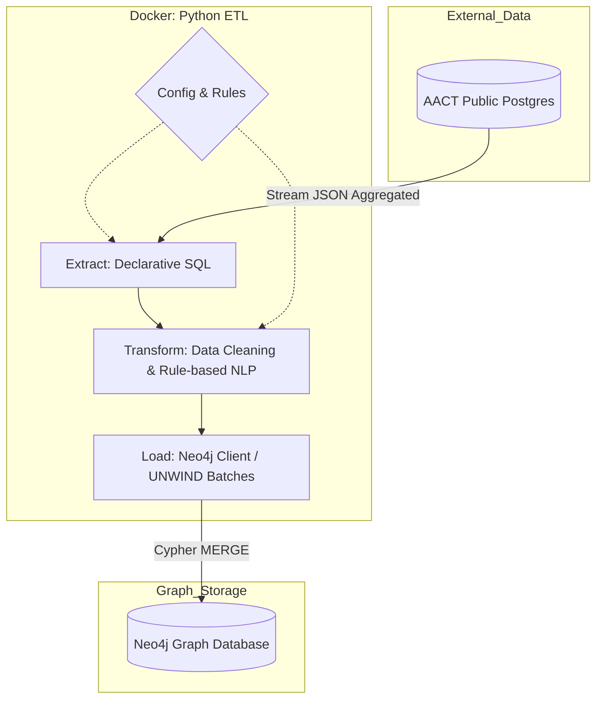
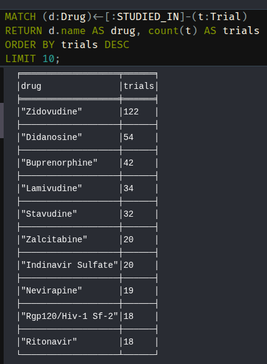
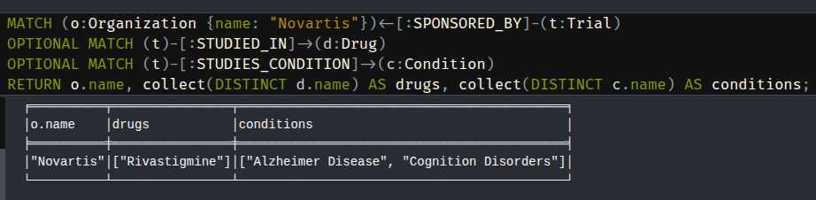
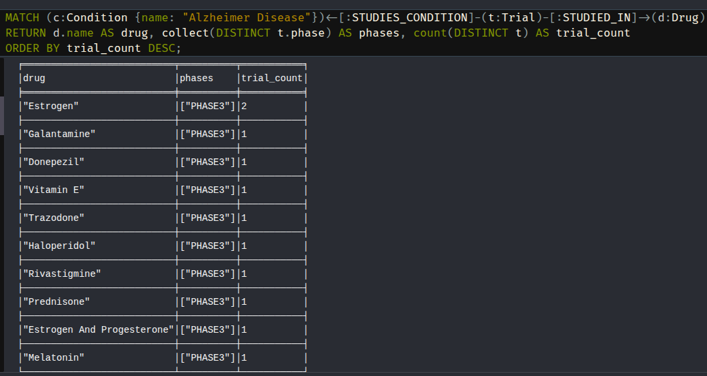
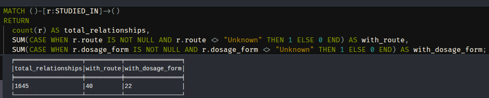

# ClinicalTrials.gov → Neo4j (AACT ETL)

## Sobre o Projeto
Este repositório implementa um pipeline ETL completo, idempotente e conteinerizado que extrai dados clínicos do AACT (PostgreSQL público do ClinicalTrials.gov), transforma e enriquece as informações, e carrega tudo em um grafo Neo4j. O objetivo é oferecer um modelo útil para exploração de:

- Ensaios clínicos (Trial)
- Drogas/Intervenções (Drug)
- Condições/Doenças (Condition)
- Patrocinadores/Organizações (Organization)
- Via de administração e forma farmacêutica (como propriedades na relação Trial–Drug)

## Arquitetura (Separação de Responsabilidades)
A arquitetura do pipeline foi desenhada para refletir separação de responsabilidades, configurabilidade e idempotência, alinhada ao que o desafio valoriza (“pipeline bem arquitetado”, “config-driven”, “batching/backpressure”, “idempotent loads”). Essa organização segue a diretriz de “estrutura clara”: cada módulo tem uma única missão (ler, processar, carregar, orquestrar), e as regras/queries ficam em config para facilitar ajustes sem tocar no código.

### Características do Sistema
- **Batch & Idempotente:** MERGE em todas as entidades. Repetir o ETL não duplica dados.
- **Config‑driven:** SQL, regras de extração de entidades e variáveis sensíveis em arquivos dedicados.
- **Leve & Reprodutível:** Rule‑based NLP em vez de LLM/NER pesado. Imagem Docker enxuta.
- **Resiliente:** Constraints e índices aplicados automaticamente. Logs claros de progresso.

## Diagrama (Visão Geral)


### Módulos principais

```
.
├── config
│   ├── extract_trials.sql
│   └── text_rules.yaml
├── src
│   ├── extract
│   │   ├── __init__.py 
│   │   └── aact_client.py
│   ├── transform
│   │   ├── __init__.py
│   │   ├── data_cleaner.py
│   │   └── text_parser.py
│   ├── load
│   │   ├── __init__.py
│   │   └── neo4j_client.py
│   └── main.py
├── tests
│   ├── test_data_cleaner.py
│   ├── test_text_parser.py
│   ├── test_readme_example.py
│   └── test_bonus_integration.py
|   scripts
|   ├── analyzes_entity_extraction_metrics.py
├── docs
│   ├── topDrugs.png
│   ├── byCompany_Novartis.png
│   ├── byCondition_Alzheimers.png
│   ├── route_dosage_form_coverage.png
├── .env
├── README.md
├── docker-compose.yml
├── Dockerfile
├── queries.cypher
└── requirements.txt
```

- `config/extract_trials.sql` — Query declarativa de extração (AACT → JSON agregado por estudo).
- `config/text_rules.yaml` — Regras declarativas de inferência (route/dosage_form) baseadas em palavras‑chave.
- `src/extract/aact_client.py` — Adapter de leitura AACT (PostgreSQL), streaming em batches.
- `src/transform/data_cleaner.py` — Normalização de campos e orquestração da limpeza (inclui route/dosage_form em STUDIED_IN).
- `src/transform/text_parser.py` — Inferência rule‑based de route/dosage_form a partir de texto livre.
- `src/load/neo4j_client.py` — Adapter de escrita Neo4j (constraints, índices, carga em lote via UNWIND).
- `src/main.py` — Orquestrador do pipeline (Extract → Transform → Load) com batch e limite configuráveis.
- `scripts/analyzes_entity_extraction_metrics.py` — Script de análise que extrai dados do AACT, analisa cobertura de drug description, calcula métricas de inferência de route/dosage_form e valida os resultados comparando com Neo4j.
- `docs`— Contém screenshots do retorno das queries, como solicitado no code challenge.
- `queries.cypher` — Consultas de demonstração para validação rápida no Neo4j.


## Testes Unitários e Teste de Integração (bônus)
- `tests/test_text_parser.py` — Teste unitário que valida parser de route/dosage_form.
- `tests/test_data_cleaner.py` — Teste unitário que valida cleaner/normalização dos dados.
- `tests/test_readme_example.py` — Teste unitário que valida um exemplo descrito nesse README (End to End de um único registro.)
- `tests/test_bonus_integration.py` — Teste de integração (bônus) que extrai, transforma e carrega um conjunto pequeno de dados no Neo4j
- Logs de testes mostram batches carregados, progresso e carregamento, úteis para monitorar execução.


## Como o Sistema Funciona (atendendo aos requisitos funcionais)

1) **Ingestão (query reproduzível, dataset não trivial, estágio clínico)**  
   - Query versionada em `config/extract_trials.sql`: estudos intervencionais em PHASE1/2/3/4 (inclui PHASE1/PHASE2, PHASE2/PHASE3) e `intervention_type IN ('DRUG','BIOLOGICAL')` (minha definição de “clinical-stage baseada na documentação”).  
   - Retorna agregado por estudo (`json_agg`) e, por padrão, processa 1000 trials (≥ 500 exigido). Sem binários/dumps: sempre dados atuais do AACT público.

2) **Transformação (campos mínimos, normalização, faltantes/duplicatas)**  
   - Captura: Drug (lista de intervenções), Condition, Organization (sponsor/collaborators), NCT ID, Title, Phase, Status; route/dosage_form se houver texto.  
   - Normaliza textos (trim/Title Case) e deduplica condições; campos ausentes viram `Unknown` em route/dosage_form em vez de gerar erro; mantém placebo para fidelidade.

3) **Modelagem e Carga (grafo, route/dosage_form contextual, idempotência) - Neo4J**  
   - Nós: Trial, Drug, Condition, Organization.  
   - Relações: `STUDIED_IN` (propriedades `route`, `dosage_form`), `SPONSORED_BY`, `STUDIES_CONDITION`. route/dosage_form ficam na relação (trial-specific), conforme enunciado.  
   - Schema garantido no start: constraints de unicidade em nct_id e nomes; índices em phase/status. Carga em lote com `UNWIND + MERGE` (idempotente, sem passos manuais).

4) **Validação (queries obrigatórias)**  
   - `queries.cypher` traz quatro consultas de validação: (1) top drugs por número de trials; (2) por empresa, listando drogas e condições; (3) por condição, mostrando drogas e fases; (4) cobertura de route/dosage_form.


## Deep Dive: O Desafio da Extração de Entidades

A inferência de route e dosage_forma farmacêutica em texto livre do ClinicalTrials.gov é difícil por falta de padronização. A estratégia escolhida é uma linha de base deliberada, priorizando precisão e transparência em detrimento de recall. A “escada” de evolução possível:

- **Nível 1 (atual) — Heurísticas / Keywords (rules):** Baixo custo, comportamento determinístico e fácil auditoria; executa em poucos segundos em ambiente Docker. A cobertura é limitada, pois muitas descrições contêm apenas o nome da droga. Nesse cenário, optamos por retornar `Unknown` em vez de assumir informações e gerar falsos positivos.
- **Nível 2 — Regex estruturado:** descartado aqui porque as descrições não seguem padrão fixo (ordem de dose/droga varia, texto é esparso).
- **Nível 3 — NLP biomédico (SciSpacy/BioBERT):** maior recall sem depender de palavras exatas; custo de imagem/build maior e mais dependências.
- **Nível 4 — LLMs/AI Functions (GPT-4, Llama-3 via Databricks ou local):** melhor assertividade potencial, mas traz custo, latência e requer validação humana (human-in-the-loop) e governança.

Posicionamento: mantivemos o Nível 1 para cumprir o desafio com leveza, reprodutibilidade e clareza. Próximos passos naturais seriam experimentar Nível 3 (modelos biomédicos) ou Nível 4 (LLM) se aceitarmos maior custo/complexidade em troca de maior recall.


## Inferência de route/dosage_form a partir do campo description
Arquivo: `config/text_rules.yaml`
- Regras de keywords para `routes` (Oral, Intravenous, Subcutaneous, etc.) e `dosage_forms` (Tablet, Injection, Cream, etc.).
- Aplicado à **description** da intervenção. Se não houver texto, retorna `Unknown`.

**Análise Detalhada da Acurácia do Método de Extração de Entidades para 1000 trials:**
- Total de relações Trial–Drug: 1.645
- Relações Trial–Drug sem drug description: 1.509 (91,7% do total)
- Relações Trial–Drug com drug description: 136 (8,3% do total)
- Das 136 relações Trial–Drug com drug description:
  - Route inferido: 40 (29,4% das que têm description)
  - Dosage_form inferido: 22 (16,2% das que têm description)
  - Ambos inferidos: 16 (11,8% das que têm description)

Esses dados podem ser verificados executando o script de análise: `analyzes_entity_extraction_metrics.py`


## Decisões e Racional

1) **Fonte AACT direta (Postgres público) vs. dump local (2GB)**
   - Opções consideradas:
     - Baixar o dump (2GB), subir um Postgres local e carregar via `pg_restore`.
     - Montar um container Postgres que baixe e restaure o dump em build.
     - Conectar direto ao Postgres público do AACT (Playground).
   - Rejeitamos dump/local porque: aumenta tempo de build, exige versionar/baixar binário grande, e congela dados (perde atualizações).
   - Escolhemos o Postgres público: é a “fonte oficial”, zero binários versionados, sempre dados atuais e experiência “clone & run” via Docker Compose (apenas credenciais no `.env`).

2) **Query relacional → JSON agregado (AACT)**
   - Alternativas: juntar no Python (mais I/O, mais lógica) ou agregar já no banco.
   - Escolha: usar `json_agg` no Postgres para devolver 1 linha por estudo com listas de drogas/condições/patrocinadores, reduzindo transferência e evitando reagrupamento manual. Mantém a transformação declarativa e versionada em SQL.

3) **Inferência de route/dosage_form por palavras‑chave (regras)**
   - Alternativas: LLM/NER (maior recall, custo/peso maiores) ou heurísticas simples. Inclui opções gerenciadas como Databricks AI Query, que facilitam mas dependem de cloud, custo e latência.
   - Escolha: regras no `config/text_rules.yaml`, porque são leves, auditáveis e reprodutíveis em ambiente Docker enxuto. Aderem ao espírito do desafio (não construir uma ontologia farmacêutica “perfeita”, mas uma abordagem razoável e documentada).

4) **Intervention types: DRUG e BIOLOGICAL**
   - Alternativas: só DRUG (perde vacinas/anticorpos) ou incluir ambos.
   - Escolha: incluir DRUG e BIOLOGICAL para cobrir small molecules, vacinas e biológicos, atendendo melhor ao critério “clinical‑stage drugs”.
   - Documentado para justificar a definição e evitar lacunas nos resultados.

5) **Placebo mantido**
   - Alternativas: filtrar placebo na extração ou na carga.
   - Escolha: manter para fidelidade à fonte e para não embutir regra de negócio, facilita auditoria. Se quiser filtrar, é um ajuste simples na SQL.

6) **Normalização de nomes com `.title()`**
   - Alternativas: pipelines de normalização avançados (sinônimos, stemming) ou manter bruto.
   - Escolha: `.title()` para reduzir variação trivial com custo baixo. Risco: acrônimos podem ser alterados (dnaJ → Dnaj); limitação registrada. Futuro: lista de exceções/sinônimos se necessário.


## Consulta de Extração (AACT)
Arquivo: `config/extract_trials.sql`
- Filtra **intervention_type IN ('DRUG', 'BIOLOGICAL')** (para cobrir small molecules e biológicos).
- Fases clínicas: `PHASE1`, `PHASE2`, `PHASE3`, `PHASE4`, `PHASE1/PHASE2`, `PHASE2/PHASE3`.
- Estudo intervencional: `study_type = 'INTERVENTIONAL'`.
- Agrupa:
  - `drugs`: lista de `{name, description}`
  - `conditions`: lista de nomes
  - `sponsors`: lista de `{name, class}`


## Exemplo do README: Esse exemplo está escrito como o teste unitário `tests/test_readme_example.py`

Extract:
```
{
  "nct_id": "NCT00000102",
  "brief_title": "Study of Drug X in Condition Y",
  "phase": "PHASE3",
  "overall_status": "COMPLETED",
  "drugs": [
    {"name": "Drug X", "description": "Oral tablet administered daily"}
  ],
  "conditions": ["Condition Y"],
  "sponsors": [
    {"name": "Example Pharma Inc", "class": "INDUSTRY"}
  ]
}
```

Transform:
```
{
  "nct_id": "NCT00000102",
  "title": "Study of Drug X in Condition Y",
  "phase": "PHASE3",
  "status": "COMPLETED",
  "drugs": [
    {"name": "Drug X", "route": "Oral", "dosage_form": "Tablet"}
  ],
  "conditions": [{"name": "Condition Y"}],
  "sponsors": [
    {"name": "Example Pharma Inc", "class": "INDUSTRY"}
  ]
}
```

Load - Exemplo de projeção tabular do grafo no Neo4j Browser
```
MATCH (t:Trial {nct_id:"NCT00000102"})
OPTIONAL MATCH (t)<-[r:STUDIED_IN]-(d:Drug)
OPTIONAL MATCH (t)-[:STUDIES_CONDITION]->(c:Condition)
OPTIONAL MATCH (t)-[s:SPONSORED_BY]->(o:Organization)
RETURN t.nct_id AS trial,
       d.name    AS drug,
       r.route   AS route,
       r.dosage_form AS dosage_form,
       c.name    AS condition,
       o.name    AS sponsor,
       s.class   AS sponsor_class;
       
┌──────────────┬────────┬──────┬────────────┬─────────────┬─────────────────────┬──────────────┐
│ trial        │ drug   │ route│ dosage_form│ condition   │ sponsor             │ sponsor_class│
├──────────────┼────────┼──────┼────────────┼─────────────┼─────────────────────┼──────────────┤
│ NCT00000102  │ Drug X │ Oral │ Tablet     │ Condition Y │ Example Pharma Inc  │ INDUSTRY     │
└──────────────┴────────┴──────┴────────────┴─────────────┴─────────────────────┴──────────────┘
```


## Modelo de Grafo (Neo4j)
- Nós: Trial (chave `nct_id`), Drug (`name`), Condition (`name`), Organization (`name`).
- Relações: Trial–Drug via STUDIED_IN (com propriedades `route` e `dosage_form` quando conhecidas); Trial–Condition via STUDIES_CONDITION; Trial–Organization via SPONSORED_BY (propriedade `class` quando conhecida).
- Constraints/Índices: unicidade em `nct_id` de Trial e nomes de Drug/Condition/Organization; índices em `Trial.phase` e `Trial.status`.


## Pré-requisitos
- Docker + Docker Compose.
- Crie uma conta AACT para usar as credenciais Postgres (criar em https://aact.ctti-clinicaltrials.org/).

Insira suas credenciais nos campos AACT_USER e AACT_PASSWORD do `.env`:
```
AACT_HOST=aact-db.ctti-clinicaltrials.org
AACT_PORT=5432
AACT_DB=aact
AACT_USER=<SEU_USUARIO>
AACT_PASSWORD=<SUA_SENHA>

NEO4J_URI=bolt://neo4j:7687
NEO4J_USER=neo4j
NEO4J_PASSWORD=password
```

## Como Rodar (End-to-End)
1) Build e suba os dois serviços (Neo4j e ETL) em ambiente limpo:
```
docker compose up --build -d
```
2) Execute o pipeline ETL (default: 1000 estudos, batch=500):
```
docker compose exec etl python src/main.py
```

3) Rode os Testes Unitários e de Integração:

- Apenas o test_text_parser:
```
docker compose exec etl python -m unittest -v tests.test_text_parser
```
- Apenas o test_data_cleaner:
```
docker compose exec etl python -m unittest -v tests.test_data_cleaner
```
- Apenas o test_readme_example (end to end de um registro):
```
docker compose exec etl python -m unittest -v tests.test_readme_example
```
- Apenas o teste de integração test_bonus_integration.py:
```
docker compose exec etl python -m unittest -v tests.test_bonus_integration
```

4) Rode o Script para Verificar as Métricas de Extração de Entidades:
```
docker compose exec etl python scripts/analyzes_entity_extraction_metrics.py

```
5) Acesse Neo4j Browser:
- URL: http://localhost:7474  
- User: `neo4j`  
- Pass: `password`

6) Realize as Consultas de Demonstração Abaixo (prontas para copiar/colar no Neo4j Browser) O arquivo `queries.cypher` contém versões parametrizadas para uso programático:
- Top drugs:
```
MATCH (d:Drug)<-[:STUDIED_IN]-(t:Trial)
RETURN d.name AS drug, count(t) AS trials
ORDER BY trials DESC
LIMIT 10;
```
- Por empresa (ex.: Novartis):
```
MATCH (o:Organization {name: "Novartis"})<-[:SPONSORED_BY]-(t:Trial)
OPTIONAL MATCH (t)-[:STUDIED_IN]->(d:Drug)
OPTIONAL MATCH (t)-[:STUDIES_CONDITION]->(c:Condition)
RETURN o.name, collect(DISTINCT d.name) AS drugs, collect(DISTINCT c.name) AS conditions;
```
- Por condição (ex.: Alzheimer Disease):
```
MATCH (c:Condition {name: "Alzheimer Disease"})<-[:STUDIES_CONDITION]-(t:Trial)-[:STUDIED_IN]->(d:Drug)
RETURN d.name AS drug, collect(DISTINCT t.phase) AS phases, count(DISTINCT t) AS trial_count
ORDER BY trial_count DESC;
```
- Cobertura rota/dosagem:
```
MATCH ()-[r:STUDIED_IN]->()
RETURN
  count(r) AS total_relationships,
  SUM(CASE WHEN r.route IS NOT NULL AND r.route <> "Unknown" THEN 1 ELSE 0 END) AS with_route,
  SUM(CASE WHEN r.dosage_form IS NOT NULL AND r.dosage_form <> "Unknown" THEN 1 ELSE 0 END) AS with_dosage_form;
```

## Exemplos de Resultados em Screenshot. Saídas baseadas nas queries do Neo4j citadas acima.

- Top drugs:


- Por empresa (ex.: Novartis):


- Por condição (ex.: Alzheimer’s disease):


- Cobertura de route/dosage_form:



## Decisões e Trade-offs
- **AACT direto (Postgres público)** em vez de dump local de 2GB: zero dependência de arquivo gigante e experiência “clone & run”.
- **Query relacional → JSON aninhado (json_agg)**: o Postgres já agrupa drogas/condições/patrocinadores por estudo, evitando lógica de reagrupamento no Python.
- **Inferência de rota/dosagem via regras (regex/keyword)**:
  - Vantagem: leve, reprodutível offline, explica cada decisão.
  - Limitação: acurácia limitada do método rule-based. Das 136 relações Trial–Drug com drug description (8,3% do total), conseguimos inferir route em apenas 29,4% delas, dosage_form em 16,2%, e ambos em 11,8%. Isso ocorre porque as descrições frequentemente não contêm as keywords exatas definidas em `text_rules.yaml`, ou usam variações linguísticas não cobertas pelas regras. Melhorias futuras: usar NER especializado (BioBERT, SciSpacy) ou LLMs com fine-tuning em textos farmacêuticos para maior recall, aceitando o trade-off de maior complexidade e custo computacional.
- **Por que não Databricks/LLM/Spacy pesado?**
  - Overkill para o escopo; aumenta dependência externa, custo e latência.
  - Repositório e imagem Docker mais enxutos; foco em clareza e reprodutibilidade.
  - Documentamos a limitação e o caminho de melhoria (usar NER/LLM no futuro).
- **Placebo como droga:** Mantido conforme fonte; decisão de negócio poderia filtrar, mas preservamos fidelidade aos dados.
- **Normalização de nomes:** `.title()` pode simplificar acrônimos (ex: dnaJ → Dnaj). Documentado como limitação aceitável.


## Próximos Passos (se houvesse mais tempo)
- NER/LLM (BioBERT/SciSpacy) para melhorar acurácia na extração de entidades route/dosage_form.
- Métricas automáticas (nós/arestas criados, coverage de campos).
- Ingestão incremental e orquestração (Airflow).


