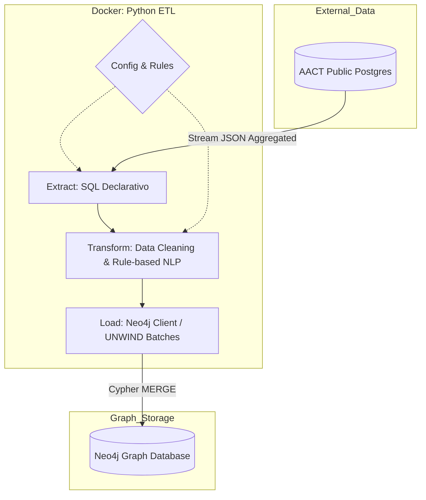

# ClinicalTrials.gov → Neo4j (AACT ETL)

## Sobre o Projeto
Este repositório implementa um pipeline ETL completo, idempotente e conteinerizado que extrai dados clínicos do AACT (PostgreSQL público do ClinicalTrials.gov), transforma e enriquece as informações, e carrega tudo em um grafo Neo4j. O objetivo é oferecer um modelo útil para exploração de:

- Ensaios clínicos (Trial)
- Drogas/Intervenções (Drug)
- Condições/Doenças (Condition)
- Patrocinadores/Organizações (Organization)
- Via de administração e forma farmacêutica (como propriedades na relação Trial–Drug)

## Arquitetura (Separação de Responsabilidades)
A arquitetura do pipeline foi desenhada para refletir separação de responsabilidades, configurabilidade e idempotência, alinhada ao que o desafio valoriza (“pipeline bem arquitetado”, “config-driven”, “batching/backpressure”, “idempotent loads”). Essa organização segue a diretriz de “estrutura clara”: cada módulo tem uma única missão (ler, processar, carregar, orquestrar), e as regras/queries ficam em config para facilitar ajustes sem tocar código.

## Diagrama (Visão Geral)


### Módulos principais (organizados em extract/transform/load)
- `config/extract_trials.sql` — Query declarativa de extração (AACT → JSON agregado por estudo).
- `config/text_rules.yaml` — Regras declarativas de inferência (rota/dosagem) baseadas em palavras‑chave.
- `src/extract/aact_client.py` — Adapter de leitura AACT (PostgreSQL), streaming em batches.
- `src/transform/data_cleaner.py` — Normalização de campos e orquestração da limpeza.
- `src/transform/text_parser.py` — Inferência rule‑based de rota/dosagem a partir de texto livre.
- `src/load/neo4j_client.py` — Adapter de escrita Neo4j (constraints, índices, carga em lote via UNWIND).
- `src/main.py` — Orquestrador do pipeline (Extract → Transform → Load) com batch e limite configuráveis.
- `queries.cypher` — Consultas de demonstração para validação rápida no Neo4j.

### Características do Sistema
- **Batch & Idempotente:** MERGE em todas as entidades; repetir o ETL não duplica dados.
- **Config‑driven:** SQL, regras de texto e variáveis sensíveis em arquivos dedicados (`.env`).
- **Leve & Reprodutível:** Rule‑based NLP em vez de LLM/NER pesado. Imagem Docker enxuta.
- **Resiliente:** Constraints e índices aplicados automaticamente. Logs claros de progresso.


## Como o Sistema Funciona (atendendo aos requisitos funcionais)

1) **Ingestão (query reproduzível, dataset não trivial, estágio clínico)**  
   - Query versionada em `config/extract_trials.sql`: estudos intervencionais em PHASE1/2/3/4 (inclui PHASE1/PHASE2, PHASE2/PHASE3) e `intervention_type IN ('DRUG','BIOLOGICAL')` (nossa definição de “clinical-stage”).  
   - Retorna agregado por estudo (`json_agg`) e, por padrão, processa 1000 trials (≥ 500 exigido). Sem binários/dumps: sempre dados atuais do AACT público.

2) **Transformação (campos mínimos, normalização, faltantes/duplicatas)**  
   - Captura: Drug (lista de intervenções), Condition, Organization (sponsor/collaborators), NCT ID, Title, Phase, Status; rota/forma se houver texto.  
   - Normaliza textos (trim/Title Case) e deduplica condições; campos ausentes viram `Unknown` em rota/forma em vez de gerar erro; mantém placebo para fidelidade.

3) **Modelagem e Carga (grafo, rota/forma contextual, idempotência) - Neo4J**  
   - Nós: Trial, Drug, Condition, Organization.  
   - Relações: `STUDIED_IN` (com `route`, `dosage_form`), `SPONSORED_BY`, `STUDIES_CONDITION`. Rota/forma ficam na relação (trial-specific), conforme o enunciado permite.  
   - Schema garantido no start: constraints de unicidade em nct_id e nomes; índices em phase/status. Carga em lote com `UNWIND + MERGE` (idempotente, sem passos manuais).

4) **Validação (queries obrigatórias)**  
   - `queries.cypher` traz: top drugs; por empresa (drugs/conditions); por condição (drugs/fases); cobertura de rota/dosagem.


## Decisões e Racional

1) **Fonte AACT direta (Postgres público) vs. dump local (2GB)**
   - Opções consideradas:
     - Baixar o dump (2GB), subir um Postgres local e carregar via `pg_restore`.
     - Montar um container Postgres que baixe e restaure o dump em build.
     - Conectar direto ao Postgres público do AACT (Playground).
   - Rejeitamos dump/local porque: aumenta tempo de build, exige versionar/baixar binário grande, e congela dados (perde atualizações).
   - Escolhemos o Postgres público: é a “fonte oficial”, zero binários versionados, sempre dados atuais e experiência “clone & run” via Docker Compose (apenas credenciais no `.env`).

2) **Query relacional → JSON agregado (AACT)**
   - Alternativas: juntar no Python (mais I/O, mais lógica) ou agregar já no banco.
   - Escolha: usar `json_agg` no Postgres para devolver 1 linha por estudo com listas de drogas/condições/patrocinadores, reduzindo transferência e evitando reagrupamento manual. Mantém a transformação declarativa e versionada em SQL.

3) **Inferência de rota/dosagem por palavras‑chave (regras)**
   - Alternativas: LLM/NER (maior recall, custo/peso maiores) ou heurísticas simples. Inclui opções gerenciadas como Databricks AI Query, que facilitam mas dependem de cloud, custo e latência.
   - Escolha: regras no `config/text_rules.yaml`, porque são leves, auditáveis e reprodutíveis em ambiente Docker enxuto. Aderem ao espírito do desafio (não construir uma ontologia farmacêutica “perfeita”, mas uma abordagem razoável e documentada).
   - Limitação: descrições pobres geram `Unknown` (~5% rota, ~1% forma em 1000 trials). Documentado como risco conhecido. Futuro: NER/LLM (BioBERT/SciSpacy), AI Query gerenciado (ex.: Databricks) ou hints no nome da droga, se aceitarmos custo/complexidade adicionais.

4) **Intervention types: DRUG e BIOLOGICAL**
   - Alternativas: só DRUG (perde vacinas/anticorpos) ou incluir ambos.
   - Escolha: incluir DRUG e BIOLOGICAL para cobrir small molecules, vacinas e biológicos, atendendo melhor ao critério “clinical‑stage drugs”.
   - Documentado para justificar a definição e evitar lacunas nos resultados.

5) **Placebo mantido**
   - Alternativas: filtrar placebo na extração ou na carga.
   - Escolha: manter para fidelidade à fonte e para não embutir regra de negócio; facilita auditoria. Se o avaliador quiser filtrar, é um ajuste simples na SQL.

6) **Normalização de nomes com `.title()`**
   - Alternativas: pipelines de normalização avançados (sinônimos, stemming) ou manter bruto.
   - Escolha: `.title()` para reduzir variação trivial com custo baixo. Risco: acrônimos podem ser alterados (dnaJ → Dnaj); limitação registrada. Futuro: lista de exceções/sinônimos se necessário.


## Deep Dive: O Desafio da Extração de Entidades

A inferência de rota e forma farmacêutica em texto livre do ClinicalTrials.gov é difícil por falta de padronização. A estratégia escolhida é uma linha de base deliberada, priorizando precisão e transparência em detrimento de recall. A “escada” de evolução possível:

- **Nível 1 (atual) — Heurísticas / Keywords (rules):** baixo custo, determinístico, auditável; roda em segundos no Docker. Cobertura limitada porque muitas descrições trazem só o nome da droga. Preferimos `Unknown` a falsos positivos.
- **Nível 2 — Regex estruturado:** descartado aqui porque as descrições não seguem padrão fixo (ordem de dose/droga varia, texto é esparso).
- **Nível 3 — NLP biomédico (SciSpacy/BioBERT):** maior recall sem depender de palavras exatas; custo de imagem/build maior e mais dependências.
- **Nível 4 — LLMs/AI Functions (GPT-4, Llama-3 via Databricks ou local):** melhor assertividade potencial, mas traz custo, latência e requer validação humana (human-in-the-loop) e governança.

Posicionamento: mantivemos o Nível 1 para cumprir o desafio com leveza, reprodutibilidade e clareza. Próximos passos naturais seriam experimentar Nível 3 (modelos biomédicos) ou Nível 4 (LLM) se aceitarmos maior custo/complexidade em troca de maior recall.


## Consulta de Extração (AACT)
Arquivo: `config/extract_trials.sql`
- Filtra **intervention_type IN ('DRUG', 'BIOLOGICAL')** (para cobrir small molecules e biológicos).
- Fases clínicas: `PHASE1`, `PHASE2`, `PHASE3`, `PHASE4`, `PHASE1/PHASE2`, `PHASE2/PHASE3`.
- Estudo intervencional: `study_type = 'INTERVENTIONAL'`.
- Agrupa:
  - `drugs`: lista de `{name, description}`
  - `conditions`: lista de nomes
  - `sponsors`: lista de `{name, class}`

Exemplo (1 registro extraído):
```
{
  "nct_id": "NCT00000102",
  "brief_title": "Study of Drug X in Condition Y",
  "phase": "PHASE3",
  "overall_status": "COMPLETED",
  "drugs": [
    {"name": "Drug X", "description": "Oral tablet administered daily"}
  ],
  "conditions": ["Condition Y"],
  "sponsors": [
    {"name": "Example Pharma Inc", "class": "INDUSTRY"}
  ]
}
```

Exemplo (mesmo registro após limpeza/transform):
```
{
  "nct_id": "NCT00000102",
  "title": "Study of Drug X in Condition Y",
  "phase": "PHASE3",
  "status": "COMPLETED",
  "drugs": [
    {"name": "Drug X", "route": "Oral", "dosage_form": "Tablet"}
  ],
  "conditions": [{"name": "Condition Y"}],
  "sponsors": [
    {"name": "Example Pharma Inc", "class": "INDUSTRY"}
  ]
}
```

Visualização típica no Neo4j Browser (consulta e resultado em tabela):
```
MATCH (t:Trial {nct_id:"NCT00000102"})
OPTIONAL MATCH (t)<-[r:STUDIED_IN]-(d:Drug)
OPTIONAL MATCH (t)-[:STUDIES_CONDITION]->(c:Condition)
OPTIONAL MATCH (t)-[s:SPONSORED_BY]->(o:Organization)
RETURN t.nct_id AS trial,
       d.name    AS drug,
       r.route   AS route,
       r.dosage_form AS dosage_form,
       c.name    AS condition,
       o.name    AS sponsor,
       s.class   AS sponsor_class;
```
Exemplo de saída:
```
┌──────────────┬────────┬──────┬────────────┬─────────────┬─────────────────────┬──────────────┐
│ trial        │ drug   │ route│ dosage_form│ condition   │ sponsor             │ sponsor_class│
├──────────────┼────────┼──────┼────────────┼─────────────┼─────────────────────┼──────────────┤
│ NCT00000102  │ Drug X │ Oral │ Tablet     │ Condition Y │ Example Pharma Inc  │ INDUSTRY     │
└──────────────┴────────┴──────┴────────────┴─────────────┴─────────────────────┴──────────────┘
```

## Modelo de Grafo (Neo4j)
- Nós: Trial (chave `nct_id`), Drug (`name`), Condition (`name`), Organization (`name`).
- Relações: Trial–Drug via STUDIED_IN (com propriedades `route` e `dosage_form` quando conhecidas); Trial–Condition via STUDIES_CONDITION; Trial–Organization via SPONSORED_BY (propriedade `class` quando conhecida).
- Constraints/Índices: unicidade em `nct_id` de Trial e nomes de Drug/Condition/Organization; índices em `Trial.phase` e `Trial.status`.

## Inferência de Rota/Dosagem
Arquivo: `config/text_rules.yaml`
- Regras de keywords para `routes` (Oral, Intravenous, Subcutaneous, etc.) e `dosage_forms` (Tablet, Injection, Cream, etc.).
- Aplicado à **description** da intervenção. Se não houver texto, retorna `Unknown`.
- Cobertura observada em 1000 trials: 1.645 relações Trial–Drug, 79 com rota (≈4,8%), 21 com forma (≈1,3%). Limitação documentada: falta de texto rico na fonte.


## Pré-requisitos
- Docker + Docker Compose.
- Conta AACT para credenciais Postgres (criar em https://aact.ctti-clinicaltrials.org/).

Exemplo de `.env` (não versionar):
```
AACT_HOST=aact-db.ctti-clinicaltrials.org
AACT_PORT=5432
AACT_DB=aact
AACT_USER=SEU_USUARIO
AACT_PASSWORD=SUASENHA

NEO4J_URI=bolt://neo4j:7687
NEO4J_USER=neo4j
NEO4J_PASSWORD=password
```

## Como Rodar (End-to-End)
1) Build e subir os dois serviços (ambiente limpo):
```
docker compose up --build -d
```
2) (Opcional) subir apenas Neo4j primeiro:
```
docker compose up -d neo4j
```
3) Subir o etl em modo ocioso (sleep):
```
docker compose up -d etl
```
4) Executar o pipeline ETL (default: 1000 estudos, batch=500):
```
docker compose exec etl python src/main.py
```
5) Acessar Neo4j Browser:
- URL: http://localhost:7474  
- User: `neo4j`  
- Pass: `password` (ajuste no `.env` se quiser)

6) Consultas de Demonstração (também em `queries.cypher`):
- Top drugs:
```
MATCH (d:Drug)<-[:STUDIED_IN]-(t:Trial)
RETURN d.name AS drug, count(t) AS trials
ORDER BY trials DESC
LIMIT 10;
```
- Por empresa (ex.: Novartis):
```
MATCH (o:Organization {name: "Novartis"})<-[:SPONSORED_BY]-(t:Trial)
OPTIONAL MATCH (t)-[:STUDIED_IN]->(d:Drug)
OPTIONAL MATCH (t)-[:STUDIES_CONDITION]->(c:Condition)
RETURN o.name, collect(DISTINCT d.name) AS drugs, collect(DISTINCT c.name) AS conditions;
```
- Por condição (ex.: Alzheimer Disease):
```
MATCH (c:Condition {name: "Alzheimer Disease"})<-[:STUDIES_CONDITION]-(t:Trial)-[:STUDIED_IN]->(d:Drug)
RETURN d.name AS drug, collect(DISTINCT t.phase) AS phases, count(DISTINCT t) AS trial_count
ORDER BY trial_count DESC;
```
- Cobertura rota/dosagem:
```
MATCH ()-[r:STUDIED_IN]->()
RETURN
  count(r) AS total_relationships,
  SUM(CASE WHEN r.route IS NOT NULL AND r.route <> "Unknown" THEN 1 ELSE 0 END) AS with_route,
  SUM(CASE WHEN r.dosage_form IS NOT NULL AND r.dosage_form <> "Unknown" THEN 1 ELSE 0 END) AS with_dosage_form;
```

7) Rodar testes unitários (verbose):
- Todos de uma vez:
```
docker compose exec etl python -m unittest -v tests.test_readme_example tests.test_text_parser tests.test_data_cleaner
```
- Apenas o exemplo do README:
```
docker compose exec etl python -m unittest -v tests.test_readme_example
```
- Apenas o parser:
```
docker compose exec etl python -m unittest -v tests.test_text_parser
```
- Apenas o cleaner:
```
docker compose exec etl python -m unittest -v tests.test_data_cleaner
```
## Ajustes de Volume
- Editar `run_pipeline(limit=..., batch_size=...)` em `src/main.py` e rodar novamente:
```
docker compose run --rm etl python src/main.py
```
- Carga é idempotente (MERGE evita duplicatas).
- Aviso: ao reexecutar, o Neo4j pode avisar que constraints/índices já existem; é esperado (uso de `IF NOT EXISTS`).


## Testes e Qualidade
- Testes unitários validam parser e limpeza (`tests/test_text_parser.py`, `tests/test_data_cleaner.py`). Rodar com: `docker compose run --rm etl python -m unittest discover tests`
- Filosofia: preferimos precisão a falsos positivos; `Unknown` é usado quando não há evidência suficiente.
- Logs do pipeline mostram batches carregados e progresso, úteis para monitorar execução.


## Limitações Conhecidas
- Baixa cobertura de rota/dosagem por falta de texto rico nas descrições de intervenção; muitos `Unknown`.
- `.title()` pode simplificar acrônimos (ex.: dnaJ → Dnaj).
- Placebo permanece como Drug (fidelidade à fonte); pode ser filtrado se desejado.
- Não usamos LLM/NER pesado para manter imagem leve e execução offline; limitação documentada.


## Decisões e Trade-offs
- **AACT direto (Postgres público)** em vez de dump local de 2GB: zero dependência de arquivo gigante e experiência “clone & run”.
- **Query relacional → JSON aninhado (json_agg)**: o Postgres já agrupa drogas/condições/patrocinadores por estudo, evitando lógica de reagrupamento no Python.
- **Inferência de rota/dosagem via regras (regex/keyword)**:
  - Vantagem: leve, reprodutível offline, explica cada decisão.
  - Limitação: cobertura limitada quando não há texto rico; não é um NER/LLM.
- **Por que não Databricks/LLM/Spacy pesado?**
  - Overkill para o escopo; aumenta dependência externa, custo e latência.
  - Repositório e imagem Docker mais enxutos; foco em clareza e reprodutibilidade.
  - Documentamos a limitação e o caminho de melhoria (usar NER/LLM no futuro).
- **Placebo como droga:** Mantido conforme fonte; decisão de negócio poderia filtrar, mas preservamos fidelidade aos dados.
- **Normalização de nomes:** `.title()` pode simplificar acrônimos (ex: dnaJ → Dnaj). Documentado como limitação aceitável.

## Exemplos de Saída (queries no Neo4j)
- Top drugs (1000 trials): Zidovudine 122, Didanosine 54, Buprenorphine 42, Lamivudine 34, Stavudine 32, Zalcitabine 20, Indinavir Sulfate 20, Nevirapine 19, Rgp120/Hiv-1 Sf-2 18, Ritonavir 18.
- Por empresa (Novartis): Drugs: Rivastigmine; Conditions: Alzheimer Disease, Cognition Disorders.
- Por condição (Alzheimer Disease): drogas PHASE3 com maior contagem incluem Estrogen (2), Galantamine (1), Donepezil (1), Vitamin E (1), Trazodone (1), Haloperidol (1), Rivastigmine (1), Prednisone (1), Estrogen And Progesterone (1), Melatonin (1).
- Cobertura rota/dosagem (1000 trials → 1.645 relações Trial–Drug): with_route 79 (~5%); with_dosage_form 21 (~1%). Baixa cobertura devido a descrições pobres; documentado como limitação da abordagem rule-based.

## Próximos Passos (se houvesse mais tempo)
- NER/LLM (BioBERT/SciSpacy) para melhorar rota/dosagem.
- Heurística no nome da droga para extrair forma/rota sem alterar o identificador.
- Métricas automáticas (nós/arestas criados, coverage de campos).
- Ingestão incremental e orquestração (Airflow/Prefect).
